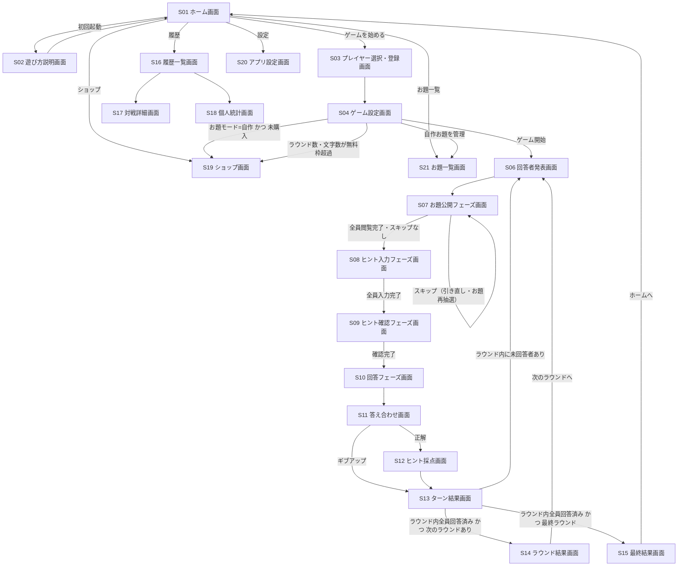

# 漢字の力画面構成・遷移フロー v1

参照元: `docs/requirements/core-requirements.md`

## 企画の理解サマリー

- **コアバリュー**：1台のiOSデバイスを囲んで複数人で遊ぶ、漢字ヒントの当てゲーム。ヒントが他の人と被らないよう選ぶ駆け引きが面白さの核。
- **ユーザー種別**：特別な権限区分はなく「参加者（プレイヤー）」のみ。ただし1ターンごとに「回答者」「ヒント出題者」の役割が入れ替わり、端末を操作する人（実質のホスト）も持ち回りになる。買い切り購入の有無で機能差が生まれる。
- **主要ユースケース**：①遊び方を理解する ②プレイヤーを登録・選択する ③ゲームを設定する ④お題公開→ヒント入力→重複削除→ヒント確認→回答→採点→ターン結果、というコアループを回す ⑤ラウンドを繰り返し最終結果を見る ⑥過去の対戦履歴・個人統計を見る ⑦オリジナルお題を管理する（買い切り限定）⑧買い切り購入をする
- **扱うデータ**：プレイヤーリスト、ゲーム設定、お題（通常／自作）、対戦履歴・個人統計（誰が何のお題に何の漢字を出したか）、購入状態

## 画面一覧

### オンボーディング・ホーム

| 画面ID | 画面名 | 役割・目的 | 対象ユーザー |
|--------|--------|-----------|-------------|
| S01 | ホーム画面 | アプリ起動後のメインハブ。「ゲームを始める」「お題一覧」「履歴」「ショップ」「設定」への入口 | 全ユーザー |
| S02 | 遊び方説明画面 | ルール説明（初回起動時に自動表示、ホームからいつでも再確認可） | 全ユーザー |
| S21 | お題一覧画面 | 通常お題・自作お題をタブで一覧表示。自作タブではお題の追加・編集・削除も行う（買い切り限定） | 全ユーザー |

### ゲームセットアップ

| 画面ID | 画面名 | 役割・目的 | 対象ユーザー |
|--------|--------|-----------|-------------|
| S03 | プレイヤー選択・登録画面 | 保存済みプレイヤーリストから今回の参加者を選択、または新規登録 | 全ユーザー |
| S04 | ゲーム設定画面 | ラウンド数・難易度・文字数・回答者決定方式・お題モード（通常／自作）を設定 | 全ユーザー |

### コアゲームプレイ（1つのお題＝1ターンごとに繰り返す）

| 画面ID | 画面名 | 役割・目的 | 対象ユーザー |
|--------|--------|-----------|-------------|
| S06 | 回答者発表画面 | このターンの回答者を表示し、パスプレイの起点にする | 全員 |
| S07 | お題公開フェーズ画面 | 回答者が見ていないことを確認したうえで、回答者以外の全員が一斉にお題を見る。回答者チェックゲート・スキップ操作を含む | ヒント出題者 |
| S08 | ヒント入力フェーズ画面 | ヒント出題者が順番に漢字を入力。本人確認モーダルを含む | ヒント出題者 |
| S09 | ヒント確認フェーズ画面 | お題と生存文字を表示。生存文字を人物単位（匿名・シャッフル順）でグルーピングし、違反があれば全員一致で手動削除 | ヒント出題者 |
| S10 | 回答フェーズ画面 | 「回答者に渡してください」の受け渡し画面を挟み（本人確認は不要）、生存文字をフラット表示して回答者がお題を入力 | 回答者 |
| S11 | 答え合わせ画面 | 正解／不正解／ギブアップを判定する操作画面 | ヒント出題者 |
| S12 | ヒント採点画面 | 正解時のみ表示。回答者が生存文字を役に立った順に並べて採点 | 回答者 |
| S13 | ターン結果画面 | 誰がどの漢字を出したか（削除分含む）と各自の得点を公開し、このターンを終了 | 全員 |
| S14 | ラウンド結果画面 | 1ラウンド（全員が回答者を経験）終了時の中間スコアボード | 全員 |
| S15 | 最終結果画面 | 全ラウンド終了後の最終順位発表 | 全員 |

### 履歴・統計

| 画面ID | 画面名 | 役割・目的 | 対象ユーザー |
|--------|--------|-----------|-------------|
| S16 | 履歴一覧画面 | 過去の対戦履歴一覧（日時・参加者・得点） | 全ユーザー |
| S17 | 対戦詳細画面 | 1回の対戦の詳細ログ（誰が何を出したか等） | 全ユーザー |
| S18 | 個人統計画面 | 有効な漢字をどれだけ出せているか等の個人集計 | 全ユーザー |

### マネタイズ・設定

| 画面ID | 画面名 | 役割・目的 | 対象ユーザー |
|--------|--------|-----------|-------------|
| S19 | ショップ画面 | 買い切り購入・購入復元 | 無料ユーザー中心（購入済みも導線として残す） |
| S20 | アプリ設定画面 | サウンド設定、購入復元、利用規約・プライバシーポリシー | 全ユーザー |

## 画面遷移フロー

## 補足・設計メモ

- **秘匿の確認動線**：S07（お題公開）は端末を回さず、「回答者が見ていないことを全員で確認 → タップしてお題表示 → 回答者以外が一斉に見る」の回答者チェックゲート方式。S08（ヒント入力）は入力が個人単位のため端末を回し、「①この端末は今誰の番か表示 → ②〇〇さんですか？の確認 → ③タップして内容表示」の3ステップを踏む。いずれも別画面に分けず、同一画面内のモーダル/オーバーレイで表現するのが自然。
- **S04とS19（ショップ）の分岐**：無料版はラウンド数上限・ヒント文字数・お題数を制限する方針のため（参加人数は無制限）、設定画面で無料枠を超える値を選ぼうとした際にショップへ誘導する導線を明示した。実際の上限値はTBD（要件のTBD参照）なので、ここでは分岐の存在のみ設計している。
- **難易度・お題モードの選択場所**：S04に集約。ラウンド単位で固定という要件（ラウンドごとに変更可）を反映し、S14（ラウンド結果画面）から次ラウンドの難易度を選び直す導線を持たせる余地がある（現状はS04のみに置いたシンプル構成。運用感を見て中間変更UIを追加する可能性あり）。
- **ギブアップの扱い**：S11で「ギブアップ」を選んだ場合はS12（採点）を飛ばしてS13へ直接遷移する分岐を明示した。
- **S13の分岐ロジック**：「ラウンド内に未回答者がいるか」「これが最終ラウンドか」の2条件でS06/S14/S15に分かれる。実装時はラウンド内の回答者キューとラウンド数カウンタで判定する形になる想定。
- **スマホ対応の観点**：全画面パスプレイ前提のため、複数人での回し読みを考慮し、文字サイズ・タップ領域を大きめに。横向き利用（対面で画面を覗き込む）への回転対応も検討候補（要件には明記がないため提案扱い）。
- **提案**：S08のような「渡す前のロック画面」は、パスプレイ系ゲームでの離脱防止・誤操作防止に重要なため、後続の詳細設計フェーズで専用のUIパターン（シェイクで隠す、大きな「タップして見る」ボタン等）を検討することを推奨する。
